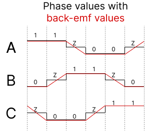
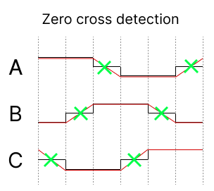

# asac esc

**A** **S**imple **A**nd **C**ool **E**lectronic **S**peed **C**ontroller (asac esc) is an open source ESC, including both hardware and software. The firmware is written in pure C.

## PCB Rev. A

First iteration of PCB is done. All cad files can be found in [kicad/asac-esc-rev-a](kicad/asac-esc-rev-a) and the schematic as PDF can be found there, or in [docs/asac-esc-rev-a.pdf](docs/asac-esc-rev-a.pdf).


## Workings of asac esc

Driving a brushless DC (bldc) motor is done by energizing one of the coils at the time which creates a magnetic field that makes the rotor move due to the magnets on it. Making the rotor move "1 step" is referred to as one *commutation* and making a bldc motor spin is not more complicated than energizing the different coils of the stator repeatedly. How fast a commutation takes will dictate how fast the motor will spin, thus controlling the speed of a bldc motor is done by controlling the speed of the commutations. This is accomplished by driving higher or lower amounts of current through the coils, which creates stronger or weaker magnetic fields, which in turn means that the commutation will be faster or slower.

#### Stator and rotor


#### 6-step commutation

Most (perhaps all?) bldc motors has more than 3 coils, but some of the coils are wired together, so that we get only *three* wires out of the motor. We can call each of these wires a *phase*, A, B and C. The commutation sequence consists of 6 unique steps, which then repeats. During each of the 6 steps, one specific phase will get current running into it, and one phase will have current running out of it. Letting current into and out of a phase can be accomplished with the help of mosfets in half-bridge configurations, whereas it's needed with one half-bridge per phase, which means 6 mosfets in total. This way of driving a bldc is motor is referred to as *6-step commutation*.

There are penty of good resources online that describes this process in much detail, such as [here](https://www.digikey.com/en/articles/how-to-power-and-control-brushless-dc-motors).

This image describes the 6 different states. It's slightly simplified, since a "1" doesn't really mean a logic high, nor 1 volt, but simply means that the phase allows current into it, whereas a "0" means that current runs out of the phase. The mosfets are not actually driven by 1s and 0s, but controlled using PWM, which is described in more detail below. The "Z" means that the phase is floating.


Below is an example os the first 2 steps, whereas current runs into phase A and out of phase B, and then out of phase C in step 2.

Commutation state 1 - Current flows into phase **A** and out of **B**.


Commutation state 2 - Current flows into phase **A** and out of **C**.


And so forth for the steps 4-6...

#### BEMF closed-loop control

While it's possible to run a bldc motor *without* any feedback, it's only going to work at a constrained speed, since we have no indication of where the rotor is. If the position of the rotor is unknown, it's impossible to know exactly *when* to turn on a specific phase, and knowing *when* to do the next commutation can be accomplished by inspecting the back electromotive (bemf) force that is induced in the third ("unused") floating phase. In the schematic above you can see that each phase has a "VSENSE_X" connected to it through a voltage divider. This will be connected to an ADC on the microcontroller.

The bemf will follow (roughly) the pattern as described in the image below:



Let's say that we're in step 3, where phase A have just been turned off and left floating. The voltage of the phase is still high, but will after some time go back to zero. The trick here is that we want to detect the middle point of this slope in order to schedule the next commutation. This "middle point" is referred to as *zero cross*. Note that the zero cross is not actually at 0, but the middle point between the highest voltage and zero, thus `zero_cross = vmax / 2`. For this to work we must know which commutation state we're in, since the slope of the bemf-values changes for each state (up/down). The bemf adc value is sampled on each update loop in order to detect when the bemf value crosses the zero cross.



Using bemf as input to know when to switch commutation step is referred to as running in *closed-loop*.

So how do we accomplish this in code? The mosfets that are connected to the high side of the half-bridges are turned on to allow current through, and the mosfets on the low side are driven low to allow current flow through them to ground. Note that the high-side mosfets are driven with a PWM signal which makes it possible to control how much current should flow through the coils. What frequency the PWM signal should have depends on the motor, but asac esc runs PWM on a frequency of 24 kHz (23437.5 Hz) with a duty resolution of 2048. Higher PWM will mean more current -> stronger magnetic field -> faster commutation.

Once a zero cross has been detected, the next commutation is scheduled to be performed in about half a commutation period from the detection. This commutation period time duration is taken from the last commutation period. Note that some delays such as update loop and filtering is subtracted, so in reality the next commutation is scheduled to be something like:
```
if (zero_cross_detected)
{
    next_commutation = now + half_commutation_period - filter_delay - update_delay
}
```

#### Start-up phase
An issue with using back-emf to know when to switch to the next commutation state is that before the motor is spinning we have no knowledge of where the rotor is. A solution to this problem is to start spinning the motor in *open-loop* mode, which means that the commutation states are traversed with a *fixed* period. During this time, the back-emf is still being looked at, to detect when we can switch to closed-loop. This is done if a zero-cross is detected, that seems to come in a "reasonable" time. By "reasonable" time, I mean that its detected roughly in the middle of a commutation period.

#### Input signal
asac esc supports standard input signals such as:
- 50 Hz (1000-2000 us)

These are all in the form of a pulse, whereas the pulse length is directly proportional to the throttle value.

The pulses are detected by an interrupt on the pin.
